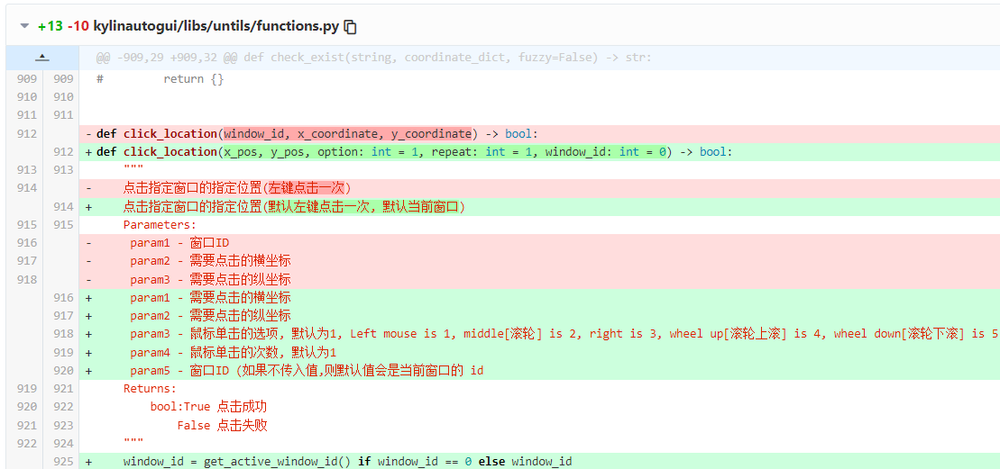
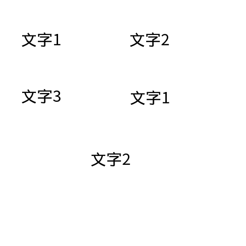
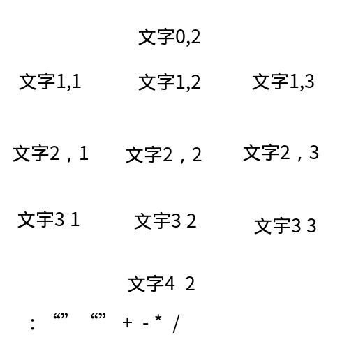

# 关于此项目的公共 API 的设计思想 【非常重要】

## 前言

首先要说明的一点是, 此项目的 kylinautogui 是基于 原来的 kylinautogui 进行的二次开发,
增删了很多东西, 目的只有一个: 打造出一套更适合此项目开发过程的自动化测试工具.
值得一提的是, 增删的过程并不是一气呵成的, 而是一边开发一边遇到问题，顺便想到可以改写或者扩充原有的 API.
某些 API 的名字、参数、返回值可能有些奇怪，因为一开始考虑不周, 后期修修补补的时候又要保证之前的代码能够运行,
所以也就这样了.

下面, 我将分几个小节依次介绍我的设计思想. 这些设计思想是改造原有工具的根本原因.

## 关于 window_id

### 如何获取 window_id ?

window_id 是一个很重要的参数, 因为很多对窗口的操作都需要获取窗口的 id.
然而, 在实践中我发现, 很多同学获取 window_id 时, 只想到利用窗口的名称获取
也就是调用原来的 get_window_id_with_window_name 方法.

> 小插曲: 我认为把 with_window_name 换成 by_window_name 更合适.

那么窗口的名称是什么呢? 这就很麻烦了. 在实践中发现, 窗口标题栏的名称可能与窗口的名称不一致.
有时窗口的名称甚至会让人难以理解. 为了解决这个问题, 我发现了一种方法, 直接调用 `xdotool getactivewindow` 命令,
此命令的输出就是当前活跃窗口的 window_id.

此后, 我又使用 python os 模块的 popen 方法获取这个返回值, 再通过 int() 转换成 int 类型.
于是, 我把这个功能封装成了一个函数: get_active_window_id.

有了这个关键的技术, 我就可以在 start_app 启动应用之后, 调用这个函数获取 window_id 了,
这比其他获取 window_id 的方法好用多了.

之后, 我又遇到一些问题: 如何获取窗口的位置和大小? 查阅了 xdotool 的手册之后, 我找到了对应的命令,
并且封装好了两个方法: get_active_window_position 和 get_active_window_size.

后来, 我在调试过程中遇到了想要同时查看窗口大小和位置等诸多信息的需要, 我就封装了一个
get_active_window_info 函数, 它可以向标准输出流输出窗口的位置和大小, 以及窗口的名称等信息.
它的作用只是帮助调试的, 所以不需要设置返回值.

### 为什么不对开发者隐藏 window_id?

当我设计了诸多函数之后, 我发现其实大部分场景都只需要在一个窗口中操作, 我们只关心激活的窗口, 也就是显示在最前端的窗口,
所以为什么我们不把 window_id 给隐藏起来呢? 我的想法是: API 不再向外提供 window_id 参数, 默认在当前激活的窗口下操作.

于是, 各位可以看到在我的 composite.py 文件里面的每个函数都没有 window_id 参数.
但凡哪个函数需要在窗口上操作, 我都在函数内部强制指定了 window_id 就是活跃窗口的 window_id.

这样做的好处非常明显: 函数的调用者再也不需要关心 window_id 的存在, 只需要保证窗口处于激活状态就可以了.
这个条件很容易满足, 只要在自动化测试过程中不对程序进行干预, 激活的窗口就永远处于程序的掌控中.

所以, 当我频繁的使用原来的 `click_location` 函数时, 由于它的第一个参数便是 window_id, 这与我的设计思想相悖,
所以我把 window_id 参数设置成了默认参数, 默认值是 0. 毕竟, 没有哪个窗口的 window_id 可能是 0.
( 虽然这里使用的结论来源于观察, 但是我觉得这个结论是正确的. )
又因为, python 规定默认参数只能出现在必需参数的后面, 所以我把 window_id 参数放在了最后.

这样做以后, 调用者不需要先获取 window_id 了, 我感觉这种设计更良好.

不过, 之前组内有些成员的代码中使用了这个函数, 所以只能委屈他们重构代码了. 其实也不难重构, 直接删去第一个 window_id 参数就行了

有关对此函数更改的信息, 请参考:
[Extend the click_location(). Enjoy it!](https://gitee.com/hulumayang/automation-test/commit/db88c9449877c509df1df80fc048dc97bf383ae2)



## 关于组合方法

### 第一阶段

在functions.py所在的文件夹下，我新加了两个文件：paddleocr.py 和 composite.py.
其中，paddleocr.py 里面是封装了一个 OCR 的接口，使用的是 paddleOCR 的服务，
之所以使用新的OCR是因为原来在 functions.py 中的OCR服务不能使用了.
虽说可以自己再次去百度申请使用原来的OCR，但是还是感觉麻烦，不如使用 paddleOCR,
本地就可以搭建服务. 考虑到校内部署了 paddleOCR 服务， 所以在 paddleocr.py 中优先使用了校内服务器的地址.
如果连不上校园网，则程序的执行流程会跳转到本地的服务，此时只需要确保本地服务已经搭建好并启动即可.

在实践过程中， 我们小组在校外的成员可以通过更改 paddleocr.py 中的代码，优先使用本地服务，这样在运行测试样例的时候可以更快.

OCR 技术可以视为自动化测试的核心，它提供的功能类似于人的眼睛。要想做好测试，只靠看是不够的，还需要“动手动脚动脑”，
也就是分析识别的结果，检索想要定位的字符串，获取字符串的位置，之后操作鼠标点击字符串对应的位置。
以上是十分常规的点击一个有文字的按钮的步骤，当然，一开始的时候还需要对窗口进行截图。

由于这套流程是十分固定的，每次点击一个按钮都简单的一步一步调用函数十分麻烦，
所以我们进行了一定程度的组装，把其中的一些步骤组合起来，方便开发者使用。

我们封装的基本思路是这样的：

- `ocr_img()` 可以返回文字识别的结果，结合`get_coordinate()`函数，可以获取到字符串的位置，
因此我们可以组合这两个函数，这便是 `ocr_img_and_get_coordinate()` 函数。

- 上面的函数没有包含截图的功能，因此我们把它和窗口截图的方法组合起来，这就可以实现截图窗口，
并且返回想要识别的文字在窗口上的位置。这便是 `screenshot_window_and_ocr()` 函数。
此后，由于发现这个函数的命名不是很合理，我又为其设置了一个别名，叫做 `get_string_coordinate_in_window()`,
这样我们就可以更加方便的使用了。（之前的代码仍然不受影响）

- 由于我们有时候想要截图的区域不是窗口，而是某个指定的区域(region), 而原有的kylinautogui也提供了此种截图的方法。
所以我们类比`screenshot_window_and_ocr()` 定义了 `screenshot_region_and_ocr()` 函数，此后同样为其设置了别名：
`get_string_coordinate_in_region()`

- 虽然有了区域截图的方法，但使用区域截图时需要提供的 region 参数的计算是相对于桌面的左上角的。在窗口移动的过程中，窗口上某一个点相对于窗口左上角的坐标是不变的，但相对于桌面的左上角的坐标是变化的。
所以，我设置了`screenshot_in_window_region_and_ocr()` 函数，在其内部进行坐标计算，把相对于窗口的坐标转换成相对于桌面的坐标, 之后再调用 `screenshot_region_and_ocr()` 函数。此后同样为其设置了别名：`get_string_coordinate_in_window_region()`

- 下面的事情就好做了，我们可以把三种类型的函数都分别与 `click_location()` 函数组合起来，实现“截图+识别+获取字符串坐标+点击”的过程。这便是一条龙服务！
这套服务有三种类型，最常用的就是`click_string_in_window()`,识别的区域是激活的窗口;
次常用的是`click_string_in_window_region()`, 识别的区域是窗口内指定的区域;
最不常用的是`click_string_in_region()`, 识别的区域是桌面内指定的区域, 虽然不常用，但它为`click_string_in_window_region()`的实现提供了便利。函数实现的详情可以查看 `composite.py` 文件。

以上涉及到的便是组合函数诞生的第一阶段。在此期间，我们确立了一个基本思想：将功能比较少的函数逐步封装，渐渐获得更多的功能。同时，所有涉及到截图的函数都具有三种类型：窗口型、区域型和窗口内部区域型。

窗口内部区域(inner_region)的坐标可以通过研究窗口的截图获得。一般是调用对窗口截图的函数，获得窗口的图片之后，使用画图软件打开截图，在其上进行矩形区域选取，下方的标题栏可以看到有关此区域的左上角坐标和大小信息。

### 第二阶段

第一阶段已经获得了很多经验，之后在实际测试时，又发现了很多现有函数无法解决的问题：

- 窗口上可以点击的按钮并没有文字，或者文字与可以点击的部分存在一个偏移量(offset)

- 窗口上的某些文字并不只出现一次，有时候有多个

- 现有的函数没有对字符串数量进行统计的功能

- 现有的函数无法直接获取字符串边框的大小

第一个问题容易解决，直接新定义一个函数，传入偏移量(offset), 在里面进行坐标计算，得到真正想要点击的位置就OK
这便是：`click_string_in_window_with_offset`、`click_string_in_region_with_offset`、`click_string_in_window_region_with_offset`的目前实现思路。

第二个问题和第三个问题本质上是一个，这是我在测试复制功能时遇到的。如果一个字符串被复制了，那么它在窗口上显示多次，怎样对字符串进行计数呢? 一番研究之后，我发现 paddleOCR 返回的原始数据在之前并没有得到合理的利用。

下面我举一个例子.

首先准备如下的一张图片.



OCR识别之后，返回的原始数据如下：（删去了不重要的部分）

```python
{'data': [{'confidence': 0.9975846409797668,
    'text': '文字1',
    'text_box_position': [[40, 62], [126, 62], [126, 98], [40, 98]]},
   {'confidence': 0.9983987212181091,
    'text': '文字2',
    'text_box_position': [[261, 62], [347, 62], [347, 98], [261, 98]]},
   {'confidence': 0.9988667964935303,
    'text': '文字3',
    'text_box_position': [[41, 177], [127, 177], [127, 213], [41, 213]]},
   {'confidence': 0.9971495270729065,
    'text': '文字1',
    'text_box_position': [[262, 180],
                          [348, 180],
                          [348, 216],
                          [262, 216]]},
   {'confidence': 0.9978631138801575,
    'text': '文字2',
    'text_box_position': [[181, 306],
                          [267, 306],
                          [267, 341],
                          [181, 341]]}],
'save_path': ''}
```

通过研究返回值，我想到了计算字符串数量的方法，同时也想到了获取字符串边框大小的方法。这时候之前的问题就都解决了
具体的实现可以看 `paddleocr.py`中`strlist` 和 `border_size` 的计算.

`ocr_img`升级之后, 返回值由之前的字典变成了元组，元组的第一个元素是原先的字典，第二个元素是识别到的字符串列表。

以此为基础，我写了一下几个函数，具体的功能不再赘述，可以查看`composite.py`源码中的注释

```python
ocr_img_and_get_string_count()
get_string_count_in_window()
get_string_count_in_region()
get_string_count_in_window_region()
get_string_border_size_in_window()
get_string_border_size_in_region()
get_string_border_size_in_window_region()
```

至此，组合函数发展的第二阶段完成.

### 对第三阶段的设想

上面举了一个图片识别的例子, 下面再举一个更复杂的例子.



这个例子里面的主要三行包含了英文逗号，中文逗号，空格作为数字的分隔符，
另外有三行是凑热闹的，主要是想验证一些个人的想法.

识别结果如下：

```python
{'data': [{'confidence': 0.9311882853507996,
            'text': '文字0,2',
            'text_box_position': [[196, 36], [290, 36], [290, 66], [196, 66]]},
           {'confidence': 0.9299401044845581,
            'text': '文字1，1',
            'text_box_position': [[23, 99], [118, 101], [117, 132], [22, 130]]},
           {'confidence': 0.9453508257865906,
            'text': '文字1,2',
            'text_box_position': [[195, 101],
                                  [290, 101],
                                  [290, 132],
                                  [195, 132]]},
           {'confidence': 0.9586127400398254,
            'text': '文字1,3',
            'text_box_position': [[359, 99],
                                  [452, 101],
                                  [450, 131],
                                  [358, 129]]},
           {'confidence': 0.9739189147949219,
            'text': '文字2，1',
            'text_box_position': [[16, 205],
                                  [128, 205],
                                  [128, 232],
                                  [16, 232]]},
           {'confidence': 0.9512718915939331,
            'text': '文字2，2',
            'text_box_position': [[179, 207],
                                  [291, 207],
                                  [291, 234],
                                  [179, 234]]},
           {'confidence': 0.9198225140571594,
            'text': '文字2,3',
            'text_box_position': [[345, 203],
                                  [459, 203],
                                  [459, 233],
                                  [345, 233]]},
           {'confidence': 0.9717211127281189,
            'text': '文宇31',
            'text_box_position': [[22, 301],
                                  [116, 299],
                                  [116, 325],
                                  [22, 328]]},
           {'confidence': 0.9645926356315613,
            'text': '文宇32',
            'text_box_position': [[189, 301],
                                  [284, 301],
                                  [284, 331],
                                  [189, 331]]},
           {'confidence': 0.9538735151290894,
            'text': '文宇33',
            'text_box_position': [[362, 309],
                                  [456, 306],
                                  [456, 334],
                                  [362, 337]]},
           {'confidence': 0.9992497563362122,
            'text': '文字42',
            'text_box_position': [[180, 391],
                                  [281, 391],
                                  [281, 418],
                                  [180, 418]]}],
  'save_path': ''}
```

研究识别结果可以发现很多有意思的事情, 比如：

- 识别字符串的顺序是：从上到下，从左到右

- OCR对于空格的识别并不咋地，两个空格和一个空格在它眼里似乎没有区别

- OCR对于逗号的识别也并不咋地，不过它提供了一个置信率，这个数据或许可以用上

- OCR对于单独出现的标点符号几乎不识别

凭借以上几条信息，我幻想了几个函数，目前还没有实现

- 获取图片上某个字符串第n次出现时的位置

- 获取图片上某个字符串第n次出现时的边界

- 获取图片上在某个字符串S1之后出现的某个字符串S2的位置

- 获取图片上在某个字符串S1之后出现的某个字符串S2的边界

- 获取图片上在某个字符串S1之后出现的某个字符串S2的出现次数

- 获取图片上"在某个字符串S1第m次出现之后"某个字符串S2的第n次出现时的位置

- 获取图片上"在某个字符串S1第m次出现之后"某个字符串S2的第n次出现时的边界

- 获取图片上"在某个字符串S1第m次出现之后"某个字符串S2的出现次数

- ...

上面的某些功能可能没啥用，只要知道可行性就已经足够了。

对OCR返回的原始数据的处理，还有很多种可能，在此就不一一列举了。

## 关于 xdotool 的使用

xdotool 的功能很强大，本项目进行了大量的使用，但也有很多功能没有用到过·
如果以后有时间，可以多写几个公共函数。

下面是一些写在 `functions.py`中的函数，利用了 xdotool.

```python
mouse_select_rectangle()
mouse_select_rectangle_in_window()
mouse_move_absolute_rel_window()
get_active_window_id()
get_active_window_size()
get_active_window_position()
get_active_window_info()
close_current_window()
click_location()
```

## 关于其他 Linux 工具的使用

paste_string()方法值得一提，它是打算取代 input_string() 的，但是
在某些场合下，它的功能可能有一些不符合预期。
不过，这个方法最大的好处是**稳定**，不会在输入中文时改变桌面的分辨率(像是遇到bug一样)，也不会出现
输入一个单词时，单词字母的顺序发生移位(如，strange 变成 stragne).

```python

def paste_string(string: str, command: str = 'ctrl+v') -> None:
    """
    通过 xclip 将字符串先复制到剪贴板里, 然后使用 ctrl+v 进行粘贴
    这个函数是为了解决 `fn.input_string()` 输入中文会改变桌面分辨率的问题
    `Warning`: echo 使用了 -n 参数, 为的是输出以后不换行, 保证字符串原样输出
    param1: 待粘贴的字符串
    param2: 键盘粘贴的命令, 默认为 ctrl+v
    """
    os.system(f'echo -n "{string}" | xclip -i -selection clipboard')
    time.sleep(1)
    assert key_input(command), f"{string}粘贴失败"
    print(f'"{string}" 粘贴成功!')
    time.sleep(1)
```

最后，感谢读者能够看到这里~
